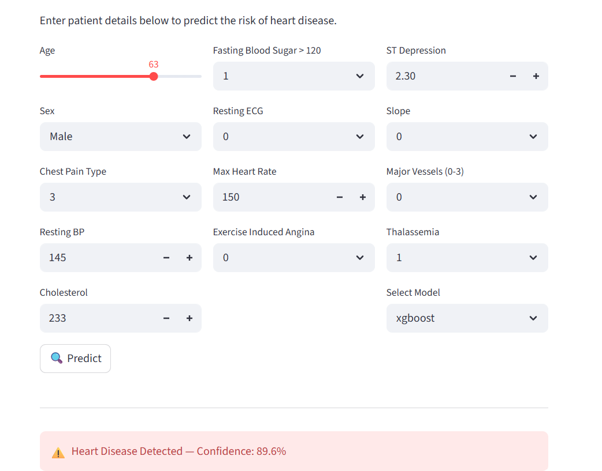

# 🫀 Heart Disease Prediction

Predict the likelihood of heart disease using Machine Learning classification algorithms.

## 📌 Algorithms Used
- Support Vector Machine (SVM)
- Logistic Regression
- Random Forest
- XGBoost

## 📊 Dataset
[Heart Disease UCI — Kaggle](https://www.kaggle.com/datasets/ronitf/heart-disease-uci)

## 📈 Results
| Model | Train Accuracy | Test Accuracy |
|---|---|---|
| SVM | 95.61% | 92.68% |
| Logistic Regression | 84.63% | 80.98% |
| Random Forest | 95.24% | 92.68% |
| XGBoost | 99.15% | 97.07% |

## 🚀 How to Run
git clone https://github.com/YOUR_USERNAME/heart-disease-prediction
cd heart-disease-prediction
pip install -r requirements.txt
cd src
python train.py
cd ../app
streamlit run app.py

## 🛠️ Tech Stack
Python, Scikit-learn, XGBoost, Pandas, Streamlit